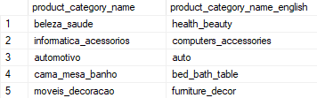

# Brazilian e-Commerce Website Data
## The Data is from [Kaggle](https://www.kaggle.com/datasets/olistbr/brazilian-ecommerce)
### Tables: 
* `olist_customers_dataset.csv` as `customers`  
 

* `olist_geolocation_dataset.csv` as `geolocations`  
 

* `olist_order_items_dataset.csv` as `order_items`  
 

* `olist_order_payments_dataset.csv` as `order_payments`  
 

* `olist_orders_dataset.csv` as `orders`  
 

* `olist_products_dataset.csv` as `products`  
 

* `olist_sellers_dataset.csv` as `sellers`  
 

* `olist_product_category_name_translation_dataset.csv` as `product_category_name_translation`
 

