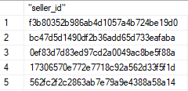
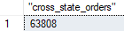
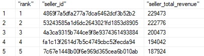

# Brazilian e-Commerce Website Data
## The Data is from [Kaggle](https://www.kaggle.com/datasets/olistbr/brazilian-ecommerce)
## Tables: 
* `olist_customers_dataset.csv` as `customers`  

 

* `olist_geolocation_dataset.csv` as `geolocations`  

 

* `olist_order_items_dataset.csv` as `order_items`  

 

* `olist_order_payments_dataset.csv` as `order_payments`  

 

* `olist_orders_dataset.csv` as `orders`  

 

* `olist_products_dataset.csv` as `products`  

 

* `olist_sellers_dataset.csv` as `sellers`  

 

* `olist_product_category_name_translation_dataset.csv` as `product_category_name_translation`

 

## Queries:
### The Queries Can be Found in the [SQL](./Brazilian%20e-Commerce.sql) File
* Number of Customers Per State  

 

* Number of Customers Per City Who Made a Purchase  

 

* List of Sellers Who Made Two or More Sales in 7 Days  

 

* Number of Sellers Per State  

 

* Number of Cross-State Purchases  

 

* List of Highest Paid Sellers  

 

* List of Cities Where Orders are Delayed Most Frequently  

 

* Average Freight Values in Each City  

 

* Product Categories with Most Boleto Purchases  

 

* Product Categories with Most Voucher Purchases  

 
